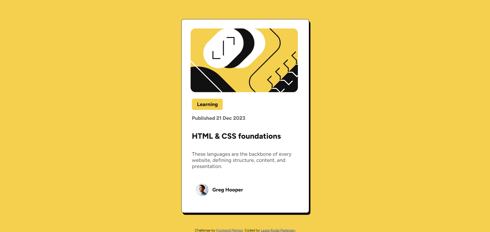
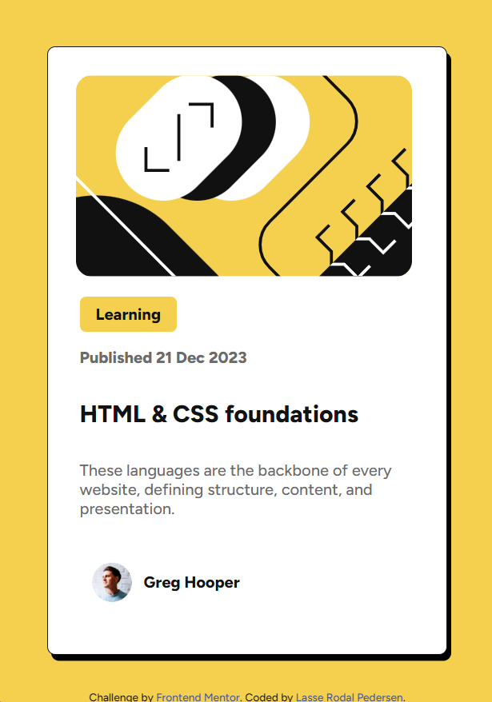

# Frontend Mentor - Blog preview card solution

This is a solution to the [Blog preview card challenge on Frontend Mentor](https://www.frontendmentor.io/challenges/blog-preview-card-ckPaj01IcS). Frontend Mentor challenges help you improve your coding skills by building realistic projects. 

## Table of contents

- [Overview](#overview)
  - [The challenge](#the-challenge)
  - [Screenshot](#screenshot)
  - [Links](#links)
- [My process](#my-process)
  - [Built with](#built-with)
  - [What I learned](#what-i-learned)
- [Author](#author)

## Overview

### The challenge

Users should be able to:

- See hover and focus states for all interactive elements on the page

### Screenshots

  
Desktop version

  

  
Mobile version

  

### Links

- Solution URL: [https://github.com/Lasse-Rodal/Blog-Preview-Card.git]
- Live Site URL: [https://lasse-rodal.github.io/Blog-Preview-Card/]

### Built with

- Semantic HTML5 markup
- CSS custom properties
- Flexbox
- Mobile-first workflow
- Responsive design

### What I learned

This challenge helped me practice my CSS and HTML skills. Additionally, I gained experience in writing README.md files and using GitHub.

## Author

- Github - [Lasse Rodal Pedersen](https://github.com/Lasse-Rodal)
